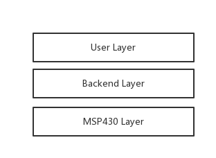
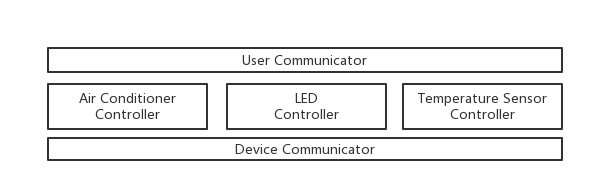
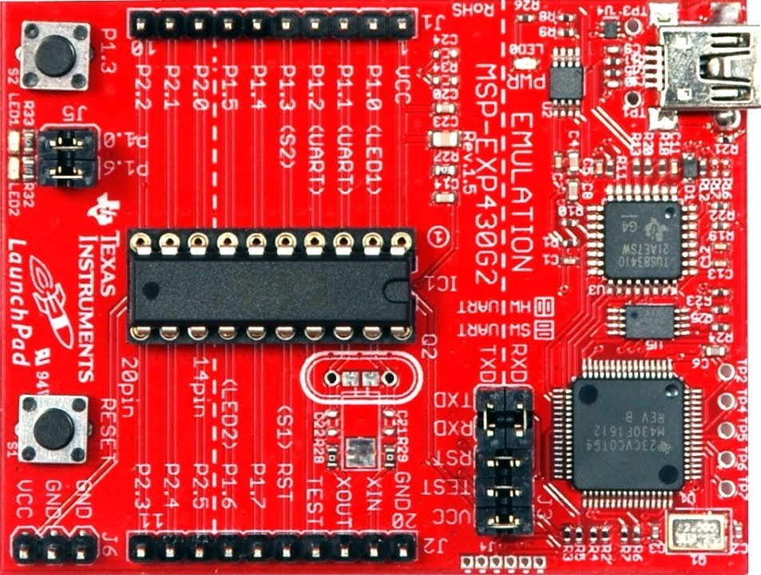
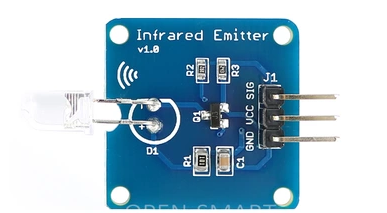
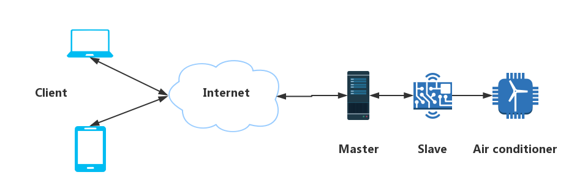
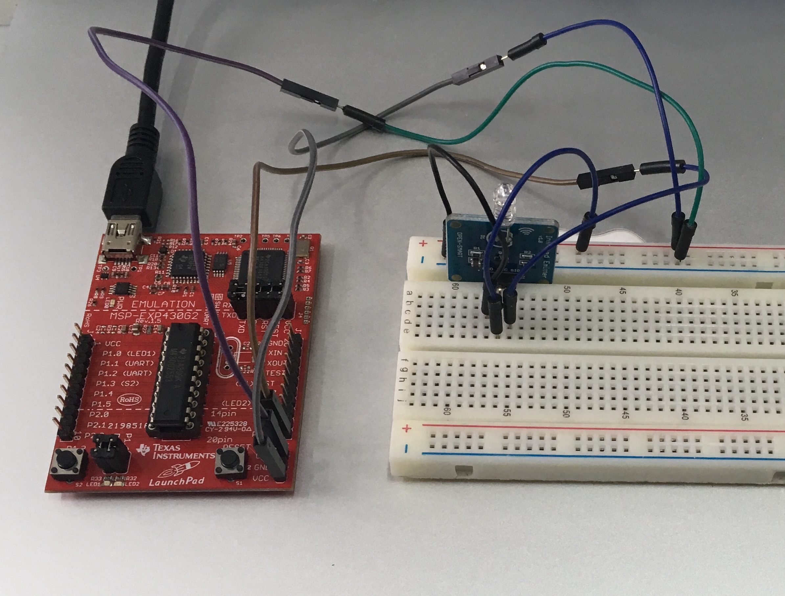
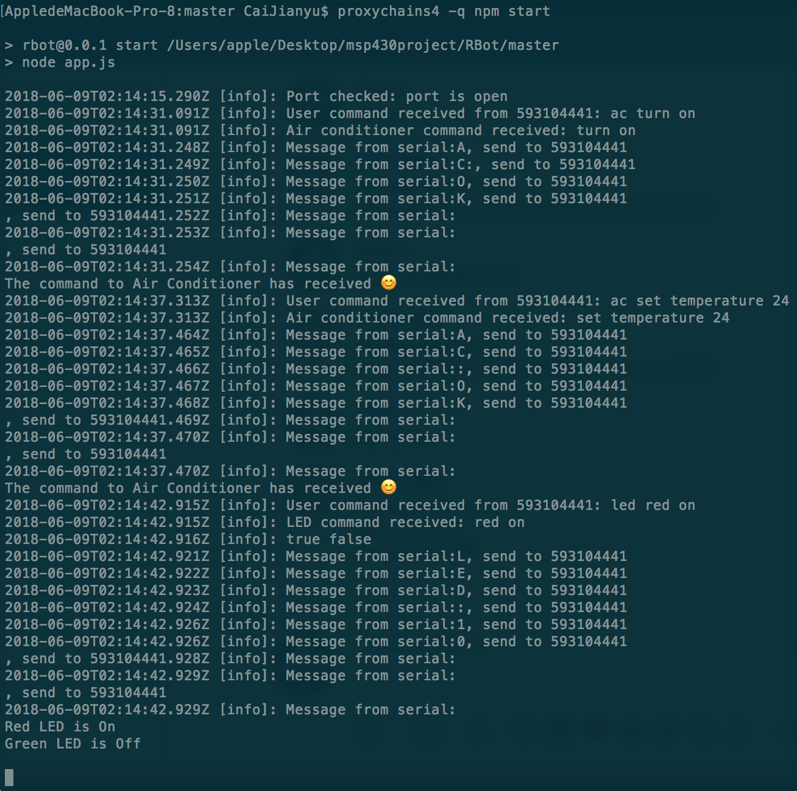
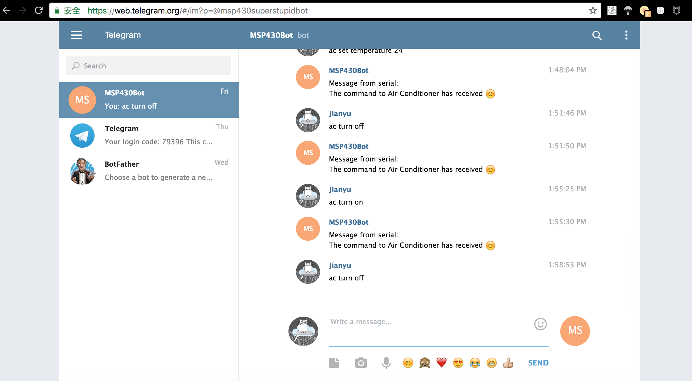

# Motivation

Nanjing is too hot.
When we finish lessons at noon and return to dormitory,
we need to tolerate the heat for extra 10 mins to wait the air conditioning to turn on
and cool the whole room.

So, why not turn on the air conditioning before we return? That requires network support,
signal emitter and so on.

Now, in the course "Computer Application System Course Design",
we need to develop a project based on board MSP 430.
So, we integrate our idea about the air conditioning above into the project,
as well as other control modules like LED and Temperature Sensor.

All of those come together into a small integrated, MSP 430 based control robot.

# General Design

Our system is divided into 3 layers: User Layer, Backend Layer and MSP 430 Layer.



User Layer is used to interact with user,
which provides an user interface to receive user inputs and display the output of system.
Here, we choose Telegram in this layer, due to its concise,
refreshing interface and more over, its robot API, which provides convenient usages.

Backend Layer act as middleman between User Layer and MSP 430 Layer.
It receives readable commands from user,
process the commands into machine-preferred code and sends the code to MSP 430 Layer.
It also receives messages from MSP 430 Layer and reply those messages to users.
We carefully designed this layer to make it clear and extensible.

MSP 430 Layer receives the codes from Backend Layer,
the codes are then decoded as operations on various devices.
It also generate messages which are sent back to Backend Layer.

So, we only develop Backend Layer and MSP 430 Layer,
the former is also called "Master", while the latter is called "Slave".

# Experiment Environment

- Ubuntu 14.04
- macOS Sierra 10.12
- Nodejs 8.9.3
- MSP430 G2553
- Energia 1.6.10E18
- Telegram

# Detailed Design

## Master

The Master part act as backend module, it receives user commands through Telegram API,
receive messages from serial port and send commands to serial port.
So, it is actually a communicator between user and MSP 430 board.

We carefully designed the structure of Master Part.



We first designed 3 models: AirConditioner, LED and TemperatureSensor
as a kind abstraction of real devices.
In particular, AirConditioner is designed as virtual class,
and we design GreeAirConditioner here as we choose Gree air conditioners as our experiment device.

Then, for each model, we design a controller class to wrap the model
and deal with all kinds of events concerning the model,
including interactions with User Communicator, Device Communicator and message processing.

To make the structure extensible, we design User Communicator
and Device Communicator to communicate with user and device separately.

The important configurations like Telegram API token and serial port are placed
in configuration file, which is deliberately omitted in gitignore.

## Slave

### Board

The Board we use is MSP430G2553



The detail documentation can be found at
[official site](http://www.ti.com.cn/cn/lit/ug/slau144j/slau144j.pdf).

### Temperature Module

MSP430G2553 is embedded with a temperature sensor, although the precision of this sensor
is not satisfying, we still use it to get the temperature of the house directly.

Temperature conversion equation is as follows:

$$
\begin{aligned}
    \begin{cases}
        V_{\text{TEMP}} &= 0.0355 \times \text{TEMP}_{C} + 0.986 \\
        V_{\text{TEMP}} &= 1.5\ V \times \dfrac{\text{Code}}{1024}
    \end{cases}
\end{aligned}
$$


### Infrared Module

#### Hardware

The infrared emmiter we use is bought from online shop.



It can emmit infrared ray in 940 nm wave length, and we can see that it has three pins,
GND for ground, VCC for power and SIG for signal. By the way, it can be powered by 3.3 voltage
or 5 voltage.

#### Encoding Rule

The air conditioner we want control is from Gree, and we find that
both the air conditioner in dorm and the air conditioner in club
can be controlled by YB0F2 remote controller.
Luckily, we find the some blogs described the encoding rule clearly,
and we document it here briefly.

##### Encoding Composition

In short, the code generated by YB0F2 contains four parts as follows:

```
+-----------+-------+--------------+-------+
| beginning | data1 | continuation | data2 |
+-----------+-------+--------------+-------+
```

- `beginning` indicates the start of a communication
- `data1` has 35 bits, which carries part of control information
- `continuation` indicates the communication should go on since
there is remaining data to be transferred.
- `data2` has 32 bits, which carries the remaining control information

##### Information Representation

Note that the carrier frequency YB0F2 use is 38 kHz, and information
is represented by infrared signal as follows:

| information  | representation                                  |
| :-:          | :-:                                             |
| bit 0        | 600  us with carrier + 600   us without carrier |
| bit 1        | 600  us with carrier + 1600  us without carrier |
| beginning    | 9000 us with carrier + 4500  us without carrier |
| continuation | 600  us with carrier + 20000 us without carrier |

##### Data Representation

```
                                    data1
                  +----+----+----+----+----+----+----+----+
                  |  0 |  1 |  2 |  3 |  4 |  5 |  6 |  7 |
                  +----+----+----+----+----+----+----+----+
                  |       a      |  b |    c    |  d |  e |
                  +----+----+----+----+----+----+----+----+
                  |  8 |  9 | 10 | 11 | 12 | 13 | 14 | 15 |
                  +----+----+----+----+----+----+----+----+
                  |         f         |         g         |
                  +----+----+----+----+----+----+----+----+
                  | 16 | 17 | 18 | 19 | 20 | 21 | 22 | 23 |
                  +----+----+----+----+----+----+----+----+
                  |         g         |  h |  i |  j |  k |
                  +----+----+----+----+----+----+----+----+
                  | 24 | 25 | 26 | 27 | 28 | 29 | 30 | 31 |
                  +----+----+----+----+----+----+----+----+
                  |  l |                 m                |
                  +----+----+----+----+----+----+----+----+
                  | 32 | 33 | 34 |
                  +----+----+----+
                  |       m      |
                  +--------------+

                                    data2
                  +----+----+----+----+----+----+----+----+
                  | 35 | 36 | 37 | 38 | 39 | 40 | 41 | 42 |
                  +----+----+----+----+----+----+----+----+
                  |  n |       o      |  p |      q       |
                  +----+----+----+----+----+----+----+----+
                  | 43 | 44 | 45 | 46 | 47 | 48 | 49 | 50 |
                  +----+----+----+----+----+----+----+----+
                  |    r    |              s              |
                  +----+----+----+----+----+----+----+----+
                  | 51 | 52 | 53 | 54 | 55 | 56 | 57 | 58 |
                  +----+----+----+----+----+----+----+----+
                  |                   s                   |
                  +----+----+----+----+----+----+----+----+
                  | 59 | 60 | 61 | 62 | 63 | 64 | 65 | 66 |
                  +----+----+----+----+----+----+----+----+
                  |    s    |  t |  u |         v         |
                  +----+----+----+----+----+----+----+----+
```

| symbol | meaning                                 |
| :-     | :-:                                     |
| a      | mode                                    |
| b      | turn on or turn off                     |
| c      | wind speed                              |
| d      | sweeping                                |
| e      | sleep                                   |
| f      | temperature                             |
| g      | timer                                   |
| h      | strong                                  |
| i      | light                                   |
| j      | health                                  |
| k      | dry                                     |
| l      | ventilation                             |
| m      | fixed, which is always 0001010010       |
| n      | up and down sweeping                    |
| o      | fixed, which is always 000              |
| p      | left and right sweeping                 |
| q      | fixed, which is always 000              |
| r      | display temperature                     |
| s      | fixed, which is always 0001000000000000 |
| t      | energy saving                           |
| u      | fixed, which is always 0                |
| v      | check sum                               |

**Running mode representation**

| mode     | representation |
| :-:      | :-:            |
| auto     | 000            |
| cool     | 100            |
| humidify | 010            |
| wind     | 110            |
| warm     | 001            |

**Wind speed representation**

| wind speed  | representation |
| :-:         | :-:            |
| auto        | 00             |
| level one   | 10             |
| level two   | 01             |
| level three | 11             |

**Temperature representation**

Temperature can range from 16 to 30 centigrade degree, both inclusive.
And the encoding rule is that code increases one bit at a time in reverse order.

| temperature | representation |
| :-:         | :-:            |
| 16          | 0000           |
| 17          | 1000           |
| 18          | 0100           |
| ...         | ...            |
| 30          | 0111           |

##### Check Sum

Steps to calculate the check sum are listed as follows:

1. let S = mode - 1 + temperature - 16 + 5 + leftAndRightSweepingFlag
\+ ventilatationFlag + energySavingFlag

2. let B to be the least significant four bits of S calculated in step 1 in binary.

3. the check sum is the reverse order of B in binary bit representation.

#### Implementation

For the sake of limited resource of board MSP 430, we divide the air conditioner control logic
into two parts. One part is responsible for generate the encoding and this is implemented in
master, another part is responsible for infrared emitter control and this is implemented in slave.

According to the encoding rule description above, generate encoding is not too hard,
but controlling the real hardware is really a difficulty because
we lack some hardware knowledge background. But luckily, there is an open source library
called [IRremote](https://github.com/z3t0/Arduino-IRremote) has provides us a template,
and finally we manage to write our code to control Gree air conditioner according to it.

## Communication

### Cloud Part

To control air conditioner remotely(e.g., open the air condition in dorm when you at classroom),
we need a server to storage and forwarding our message.

Here are two choices: virtual server provided by Tencent Cloud with Wechat facility and Telegram.
If we choose the former, the advantage is that Wechat is so popular with Chinese people
and Wechat miniprogram can also be customized to suit our needs, but the disadvantage is that
a lot of work needs to be done on the server side. For the sake of limited time,
finally we choose Telegram. Telegram is a really nice application, and it can be built on many
OS. What's more, it is open source and has public API for developer. But it is such a pity
that it seems to be banned by GFW.

Anyhow, currently we choose Telegram, and we managed to implement what we want in 5 days.
But for the long run, it seems that forwarding message by our own server with Wechat miniprogram
feature is a better choice.

### House Part

We have Raspberry PI, Arduino and MSP430 in hand, although Raspberry PI is the most powerful one,
but MSP430 is the board given by the course teacher, so we finally develop our application based on
this board. To my surprise, this board has only 512 byte memory, not to mention network module.
And after we finished our application, the teacher told us that he has wifi module,
but it seems to be a bit late.

To receive the message from the internet, only has MSP430 is not enough.
Currently our implementation needs a master to handle message forwarding for MSP430,
but if we have wifi module or use Raspberry PI, master and slave may be integrated into one
single chip without too much change to our code.

### High Level Data Flow

At present, our high level data flow is as follows:



Note that all the communications are bidirentional except the one between slave and air conditioner,
because we can not get the response of the air conditioner at present.

# Screenshots

Currently, we've implement what we want: start the air conditioner in our dorm
when we are in classroom.

The following are some photos:








# Reference

[Telegram](https://telegram.org/)

[Telegram Control Application](https://hackaday.io/project/9745-telegram-control-application)

[TelegramControl](https://github.com/ErhanYILMAZ/TelegramControl)

[Node Serialport documentation](https://node-serialport.github.io/node-serialport/)

[Nodejs documentation](https://nodejs.org/dist/latest-v8.x/docs/api/)

[Energia](https://github.com/energia/Energia)

[IRremote module](https://github.com/z3t0/Arduino-IRremote)

[Gree Air-conditioner Infrared Code Analysis](https://blog.csdn.net/u013247982/article/details/37914581)
